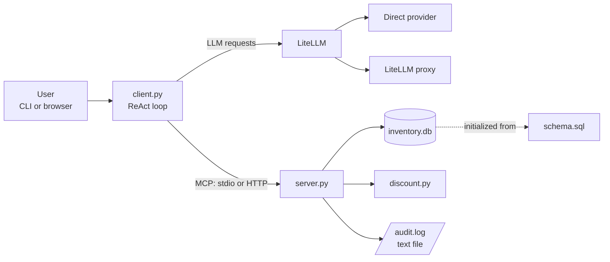

# MCP inventory assistant

This repository contains a Python MCP server and an LLM client for a small
computer-parts inventory. The server exposes:

- SQLite product lookup tools (`lookup_product`, `lookup_products`)
- A tiered-discount calculator (`quote_discount`)
- An append-only audit tool (`log_event`)
- The `audit://log` resource for reading the audit file

`client.py` discovers these tools over MCP and runs a ReAct
reason → tool call → result loop through LiteLLM. It can be used from a
terminal, a browser, or a single non-interactive demo prompt.

## How the pieces fit together



The client never imports the server's tool functions. It first discovers the
MCP tools, gives their schemas to the LLM, executes requested calls through
MCP, and sends the results back to the LLM for the final response.

## Setup

Requires Python 3.12. The project was developed and tested with Python 3.12.

```bash
git clone https://github.com/jkjanetschek/indusrial_computing_part1.git
cd indusrial_computing_part1

python -m venv .venv
source .venv/bin/activate       # Windows: .venv\Scripts\activate
pip install -r requirements.txt

cp .env.example .env
```

Edit `.env` before running the client.

## Environment variables

### LLM mode

`LLM_MODE` selects how `client.py` calls the model:

- `direct`: LiteLLM calls a provider directly. Set either
  `GEMINI_API_KEY` and `MODEL_NAME_GEMINI`, or `OPENAI_API_KEY` and
  `MODEL_NAME_OPENAI`.
- `proxy`: LiteLLM sends requests to a proxy. Set `LITELLM_API_BASE`,
  `LITELLM_KEY`, and `MODEL_NAME_PROXY`.

### MCP transport

`MCP_TRANSPORT` controls how the client reaches `server.py`:

- `stdio`: the client starts `server.py` as a subprocess. This is the
  simplest local mode and needs no separate server command.
- `http`: start the server separately with `python server.py`; the client
  connects to `http://localhost:8000/mcp`.

The server uses the same `MCP_TRANSPORT` value. Database and log locations can
be changed with `INVENTORY_DB`, `AUDIT_LOG`, and `AGENT_LOG`.

### Client mode

`client.py` selects its user interface in this order:

1. `WEB_MODE=true`: starts the browser UI on `WEB_PORT` (default `8080`).
2. `DEMO_MODE` plus `DEMO_PROMPT`: runs one prompt and exits.
3. Otherwise: starts the interactive terminal client.

## Run

### Local stdio client

Set `MCP_TRANSPORT=stdio` in `.env`, then run:

```bash
python client.py
```

For one non-interactive request:

```bash
DEMO_MODE=true \
DEMO_PROMPT="List the graphics cards and their stock levels." \
python client.py
```

For the browser UI:

```bash
WEB_MODE=true python client.py
# Open http://127.0.0.1:8080
```

### HTTP server and client

In one terminal:

```bash
MCP_TRANSPORT=http python server.py
```

In another terminal, with `MCP_TRANSPORT=http` in `.env`:

```bash
python client.py
```

The HTTP server listens on port `8000`. The first startup creates
`inventory.db` from `schema.sql` if the database does not already exist.

### MCP smoke test

This checks tool discovery, a product lookup, audit logging, and the audit
resource without starting a persistent server:

```bash
MCP_SMOKE_TEST=true python server.py
```

## Useful files

| File | Purpose |
| --- | --- |
| `server.py` | MCP tools, resource, and stdio/HTTP server entry point |
| `client.py` | LiteLLM ReAct loop and CLI/web/demo modes |
| `database.py`, `schema.sql` | SQLite inventory setup and queries |
| `discount.py` | Tiered discount calculation |
| `audit.py` | File-based audit logging |
| `.env.example` | Configuration template |
| `evidence/` | Example client and audit logs |
| `docs/` | One-page write-up and screenshots |
