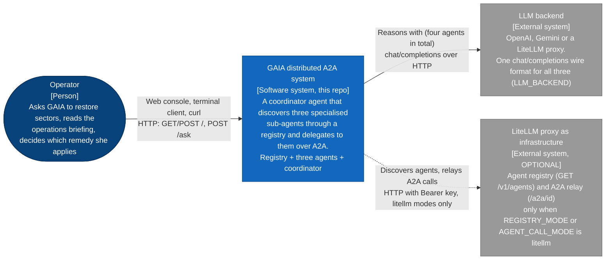

# L1: System context

**Question:** what is this system, who uses it, and what outside itself does
it depend on?
**Audience:** everyone. Legend in [README.md](README.md).

## What the diagram says

The system is one box here on purpose: to the operator it is "GAIA", a
single conversation partner reachable through three doors (browser, terminal,
`curl`) that all share one memory per thread. What makes it a *distributed*
system is invisible at this level and is the subject of L2.

Two things outside the box:

- The **LLM backend** is where every model call goes, for GAIA and for each
  sub-agent. `shared/settings.py` selects OpenAI, Gemini or LiteLLM by
  changing only `base_url` and key; no provider SDK is used anywhere
  (`agents/model_factory.py`, `coordinator/model_factory.py`).
- The **LiteLLM proxy as infrastructure** is drawn dashed because it is a
  mode, not a requirement. With the defaults (`REGISTRY_MODE=own`,
  `AGENT_CALL_MODE=direct`) it is not contacted at all; the stack has its own
  registry and calls agents directly. `docs/design-notes.md` "Registry mode" and
  "Coordinator: calling agents" explain the two switches.

Decision embodied: the coordinator cannot answer a restoration question
alone. AETHER knows the air, DEMETER knows the flora, HEPHAESTUS knows the
machines, and each incident they report needs another one to resolve. That
is the assignment's "one planner that must delegate", and it is why the box
contains more than one agent.

## Traceability

| Element | Where it is defined |
|---|---|
| Operator doors | `coordinator/templates.py` (page), `coordinator/main.py` (terminal), `POST /ask` in `coordinator/api.py` |
| System boundary | `docker-compose.yml`: five services, one image |
| LLM backend | `shared/settings.py` `LLM_BACKEND`, `_BackendEndpoints`, `resolved_base_url` |
| LiteLLM proxy | `shared/settings.py` `REGISTRY_MODE`, `AGENT_CALL_MODE`, `LITELLM_PROXY_URL`; `coordinator/registry_client.py`, `coordinator/agent_client.py` |
