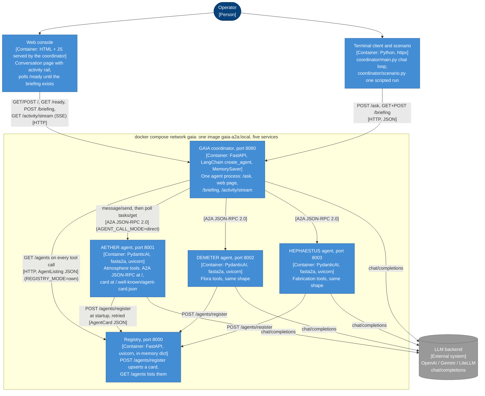

# L2: Containers

**Question:** what are the deployable units, and how do they talk to each
other?
**Audience:** whoever runs `docker compose up`; the reviewer of the
submission. Legend in [README.md](README.md).

## What the diagram says

Five processes from one image; only the `command:` differs
(`docker-compose.yml`, `Dockerfile`). The three agents are separate boxes and
not one "agents" box because they are separate processes that share no data:
each holds its own table (`SECTOR_ATMOSPHERE`, `SECTOR_FLORA`, `CAULDRONS`),
and what they share is only code (`agents/a2a_server.py`, `registration.py`,
`catalog.py`, `mutations.py`, `shared/`).

**Startup order** (compose `depends_on` with `condition: service_healthy`):
registry -> the three agents -> coordinator. An agent's healthcheck is its
own agent card; the coordinator's is `/health`, which answers as soon as the
process serves because the briefing handshake runs as a background task.

**The two arrows that are mode switches.** `coordinator -> registry` is
`REGISTRY_MODE=own`; with `litellm` the same call goes to the LiteLLM proxy's
`GET /v1/agents` instead (L1 shows the proxy). `coordinator -> agent` is
`AGENT_CALL_MODE=direct`; with `litellm` the same JSON-RPC body goes to the
proxy's `/a2a/{agent_id}` relay. Both switches are a dict of functions in one
module each (`registry_client._FETCHERS`, `agent_client._ROUTES`), so no
other container knows the mode.

**Why the clients are containers.** The web console is HTML+JS served by the
coordinator, and the terminal client is a separate Python process; both are
clients of the *one* running GAIA. There is deliberately no second agent in
the terminal: two processes would mean two `MemorySaver`s and two
conversations (`docs/design-notes.md`, "GAIA: the coordinator").

**Ports.** 8000 to 8003 are published for inspection from the host (`curl
localhost:8000/agents`, agent cards). GAIA never uses them; inside the network
she talks service names (`http://aether-agent:8001`), which are the URLs the
agents register with.

## Traceability

| Arrow | Source |
|---|---|
| agent -> registry | `agents/registration.py:63` `register_with_registry`, wired by `with_self_registration` (`:98`) into the app's lifespan |
| coordinator -> registry | `coordinator/registry_client.py:55` `_from_own_registry`, called from `tools.lookup_agents` (`tools.py:25`) and `tools.call_agent` (`:37`) and `briefing.collect_reports` (`briefing.py:82`) |
| coordinator -> agents | `coordinator/agent_client.py:120` `AgentClient.call` |
| every agent -> LLM | `agents/model_factory.py`, `coordinator/model_factory.py` |
| browser -> coordinator | routes in `coordinator/api.py:132` to `:231`; fetch/EventSource calls in `coordinator/templates.py` |
| terminal -> coordinator | `coordinator/main.py` `ASK_PATH`, `BRIEFING_PATH`; `coordinator/scenario.py` |
| startup order, ports, healthchecks | `docker-compose.yml` |
