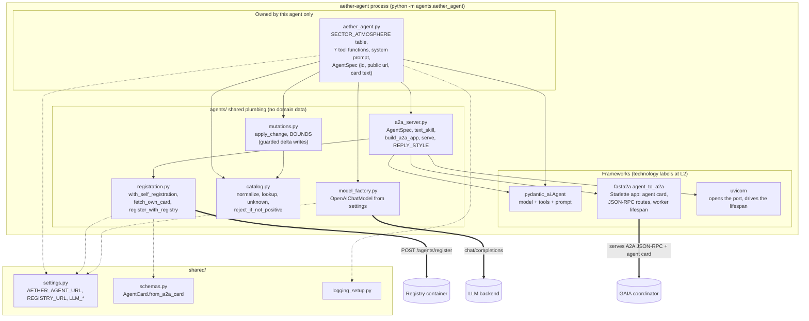
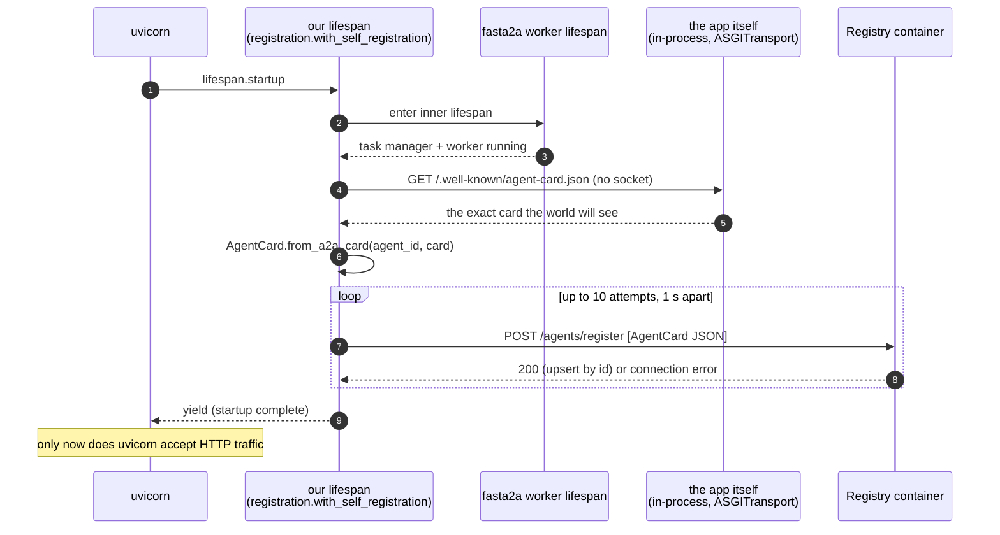

# L3: Components of one sub-agent (AETHER)

**Question:** what are the parts inside one A2A agent process, and how does
it come up?
**Audience:** someone adding a fourth agent or changing how the three are
exposed. Legend in [README.md](README.md).

AETHER is drawn; DEMETER and HEPHAESTUS are the same diagram with a
different agent module (same imports, line for line: `demeter_agent.py:21-26`,
`hephaestus_agent.py:23-28`). That sameness is the point of
`agents/a2a_server.py`: an agent module declares data, tools and an
`AgentSpec`, and everything about how it is served is shared.

## How the process comes up (the lifespan nesting)

This is the one mechanism in `agents/` that is not obvious from the import
graph, so it is spelled out. Everything below happens once, in order, when
`serve()` calls `uvicorn.run`:

Why it is built this way (`registration.py` module docstring and
`with_self_registration` docstring say the same in more words):

- `agent_to_a2a` installs its own lifespan, which is what runs
  `message/send` tasks. Passing our lifespan to `agent_to_a2a` would
  *replace* it and leave an agent whose tasks never complete. So the
  installed lifespan is read back off `app.router.lifespan_context` and
  wrapped: a decorator around a context manager.
- The card is fetched in-process because the port is not open yet (uvicorn
  opens it after startup), and because the served JSON is then the single
  source of truth: there is no hand-built copy of the card that could drift.
- Registration is retried because compose starts services in parallel and
  the registry may be a second slower; after the last attempt it raises,
  which fails startup and makes compose show the container as failed rather
  than silently running an undiscoverable agent.

## How a request is answered (for contrast, no diagram needed)

`POST /` with `message/send` -> fasta2a stores a task and returns it as
`submitted` -> the worker runs the PydanticAI `Agent` (model call, tool
calls into `aether_agent.py` functions, model call) -> the task becomes
`completed` with the answer as an artifact -> the coordinator's poll of
`tasks/get` sees it. The client half of this is L4
[c4-l4-agent-client.md](c4-l4-agent-client.md).

## Edge table

| From | To | Line |
|---|---|---|
| aether_agent | a2a_server | `aether_agent.py:18` |
| aether_agent | catalog | `aether_agent.py:19` |
| aether_agent | model_factory | `aether_agent.py:20` |
| aether_agent | mutations | `aether_agent.py:21` |
| aether_agent | shared | `aether_agent.py:22-23` |
| aether_agent | pydantic_ai | `aether_agent.py:16` |
| mutations | catalog | `mutations.py:16` |
| a2a_server | registration | `a2a_server.py:19` |
| a2a_server | fasta2a, pydantic_ai, uvicorn | `a2a_server.py:13-17` |
| registration | shared | `registration.py:34-35` |
| registration | starlette (type only) | `registration.py:32` |
| model_factory | shared | `model_factory.py:12` |

What is deliberately *not* an arrow: `aether_agent` never imports
`demeter_agent` or `hephaestus_agent`, and no shared module holds domain
data. `mutations.BOUNDS` is shared because the *units* are shared
(percentages, unit counts), not the tables; the comment above `BOUNDS` says
what to do if two agents ever need the same field name with different ranges.
