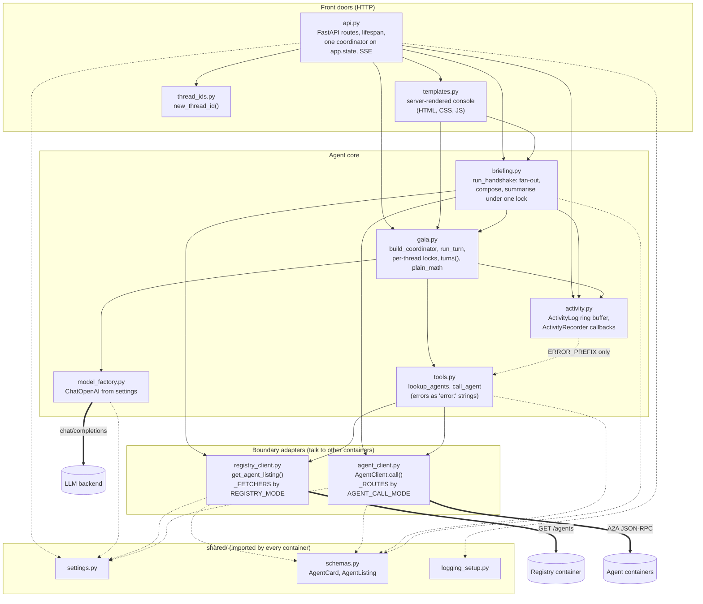

# L3: Components of the GAIA coordinator

**Question:** what are the major parts inside the coordinator container, and
which depends on which?
**Audience:** someone about to change `coordinator/`. Legend in
[README.md](README.md). Every arrow is one `import` line; the table below
gives the line numbers.

Solid arrows are imports inside the package; dashed arrows are imports of
`shared/`; thick arrows leave the container (those are the L2 arrows, drawn
here only to show which component owns each one).

## What the diagram says

**The dependency direction is clean.** Front doors depend on the core, the
core depends on the boundary adapters, and nothing points back up. There is
no import cycle in `coordinator/`. The one arrow that looks sideways,
`activity -> tools`, imports a single constant (`ERROR_PREFIX`) so the rail
can recognise a failed A2A call, which by design is a *string* result, not
an exception. `gaia.py` imports `activity.py` and `activity.py` does not
import `gaia.py`; `routing_args` lives in `activity.py` for exactly that
reason (its docstring says so).

**Three patterns, one per component group:**

- **Strategy tables** in the boundary adapters. `registry_client._FETCHERS`
  and `agent_client._ROUTES` are dicts from a settings `Literal` to a
  function. Adding a mode is one entry plus the `Literal`; no `if` on the
  mode exists anywhere else.
- **Observer through LangChain callbacks.** `ActivityRecorder` is a
  `BaseCallbackHandler` that `gaia.run_turn` passes into `ainvoke`. LangGraph
  propagates it into the model and the tools, so `tools.py` is not
  instrumented at all and still every call shows on the rail.
- **Deterministic orchestration, model-driven synthesis** in `briefing.py`.
  The fan-out is a `for` loop over the registry listing (a model may skip an
  agent; a loop cannot), and only the composing and summarising are GAIA
  turns.

**Concurrency rule worth knowing before editing.** `gaia._thread_locks` is
one `asyncio.Lock` per `thread_id`. `ask_message` takes it per turn;
`run_handshake` holds it across its two turns and therefore must call
`run_turn` (which does not lock) rather than `ask_message` (which does), or
it deadlocks. Both docstrings spell this out.

## Edge table (the diagram is this table drawn)

| From | To | Line | What is imported |
|---|---|---|---|
| api | activity | `api.py:34` | `Event`, `activity_log` |
| api | briefing | `api.py:35` | `BRIEFING_FULL`, `BRIEFING_SUMMARY`, `BRIEFING_THREAD_ID`, `run_handshake` |
| api | gaia | `api.py:36` | `Turn`, `ask`, `build_coordinator`, `thread_messages`, `turns` |
| api | templates | `api.py:37` | `render_page`, `render_waiting_page` |
| api | thread_ids | `api.py:38` | `new_thread_id` |
| api | shared | `api.py:39-40` | `configure`, `settings` |
| templates | briefing | `templates.py:16` | the two markers |
| templates | gaia | `templates.py:17` | `Turn` |
| briefing | activity | `briefing.py:29` | `BYTES_PER_KB`, `activity_log` |
| briefing | agent_client | `briefing.py:30` | `AgentCallError`, `AgentClient` |
| briefing | gaia | `briefing.py:31` | `run_turn`, `thread_lock` |
| briefing | registry_client | `briefing.py:32` | `get_agent_listing` |
| briefing | shared | `briefing.py:33` | `AgentCard` |
| gaia | activity | `gaia.py:35` | `ActivityRecorder`, `activity_log`, `routing_args` |
| gaia | model_factory | `gaia.py:36` | `get_langchain_model` |
| gaia | tools | `gaia.py:37` | `call_agent`, `lookup_agents` |
| tools | agent_client | `tools.py:14` | `AgentCallError`, `AgentClient` |
| tools | registry_client | `tools.py:15` | `get_agent_listing` |
| tools | shared | `tools.py:16` | `AgentCard` |
| activity | tools | `activity.py:32` | `ERROR_PREFIX` |
| model_factory | shared | `model_factory.py:9` | `settings` |
| registry_client | shared | `registry_client.py:27-28` | `AgentCard`, `AgentListing`, `RegistryMode`, `settings` |
| agent_client | shared | `agent_client.py:67-68` | `AgentCard`, `AgentCallMode`, `settings` |
| main | thread_ids, shared | `main.py:17-18` | `new_thread_id`, `settings` (terminal client; not in the container's process, so not drawn) |
| scenario | main | `scenario.py:16` | paths and client factory (same) |

Framework dependencies not drawn (they are the technology labels at L2):
`api.py` -> FastAPI; `gaia.py` -> `langchain.agents.create_agent`, LangGraph
`MemorySaver`; `tools.py` -> `langchain_core.tools.tool`; `activity.py` ->
`langchain_core.callbacks.BaseCallbackHandler`; `agent_client.py`,
`registry_client.py` -> httpx; `templates.py` -> markdown-it.
