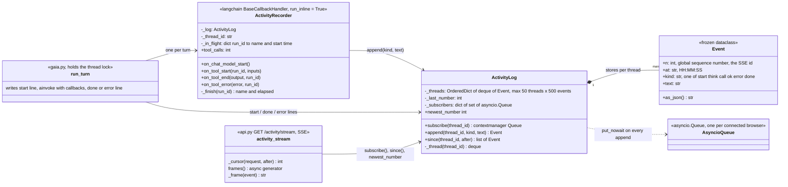
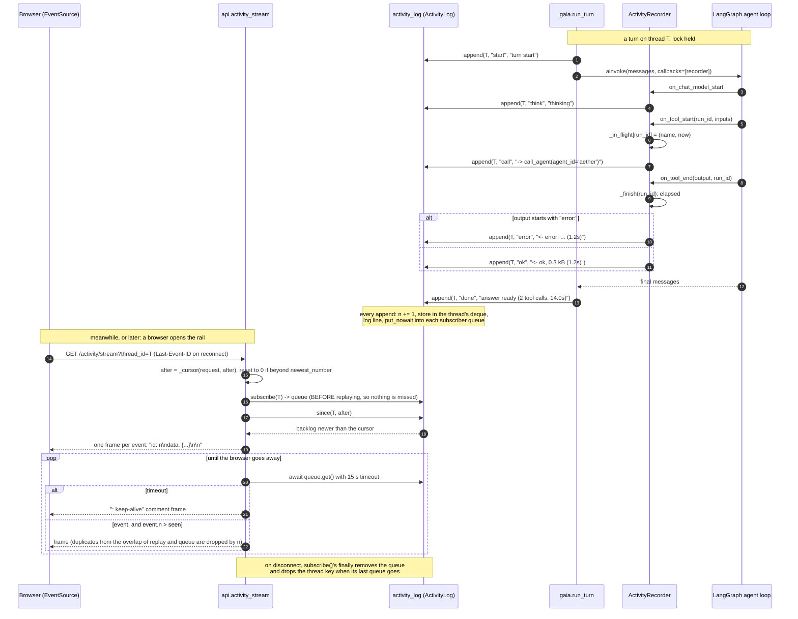

# L4: Code, the activity rail (`coordinator/activity.py`, `gaia.run_turn`, `api.activity_stream`)

**Question:** how does a tool call inside a GAIA turn become a line on the
browser's activity rail, and how does a browser that connects late still see
it?
**Audience:** the developer editing `activity.py`, `run_turn` or the SSE
route. Legend in [README.md](README.md).

## Shape

`activity_log` is one module-level `ActivityLog` per process
(`activity.py:211`), like `tools.agent_client`; tests swap the attribute.

## Mechanism: from a tool call to a rail line, and to a late browser

## Why it is built this way (each point is a comment in the code)

- **`run_inline = True`** on the recorder: langchain-core would otherwise
  dispatch a sync handler on an executor thread, and `asyncio.Queue` is not
  thread-safe. Inline also keeps the callback lines ordered with the
  start/done lines `run_turn` writes on the loop.
- **A queue per subscriber, not a shared `asyncio.Event`.** Set-then-clear
  is missed by any subscriber not yet at its `await`; a queue holds the
  event until read.
- **Store, do not just stream.** The ring buffer is what lets a browser that
  connects after the startup handshake (which runs in the lifespan, before
  any browser exists) still see it, and what survives a page reload.
- **Bounded on both axes.** 500 events per thread, 50 threads, oldest
  touched thread evicted; and `since()` never creates a thread entry,
  because `thread_id` arrives from an unauthenticated query parameter.
- **Global event numbers as SSE ids.** `EventSource` reconnects on its own
  and sends `Last-Event-ID`; `_cursor` honours it unless it is from a
  previous process (greater than `newest_number`), in which case it replays
  from the start rather than filtering everything out.
- **Error detection by prefix.** A failed A2A call does not raise (by
  design, so GAIA can reason about it), so `on_tool_end` checks for
  `tools.ERROR_PREFIX`; without it a failed call would render as `ok`.

| Element | Line |
|---|---|
| `routing_args` | `activity.py:50` |
| `Event` | `:61` |
| `ActivityLog` (`subscribe`, `append`, `newest_number`, `since`, `_thread`) | `:74` |
| `ActivityRecorder` | `:151` |
| `activity_log` singleton | `:211` |
| `gaia.run_turn` | `gaia.py:190` |
| `api.activity_stream`, `_frame`, `_cursor` | `api.py:231`, `:278`, `:283` |
