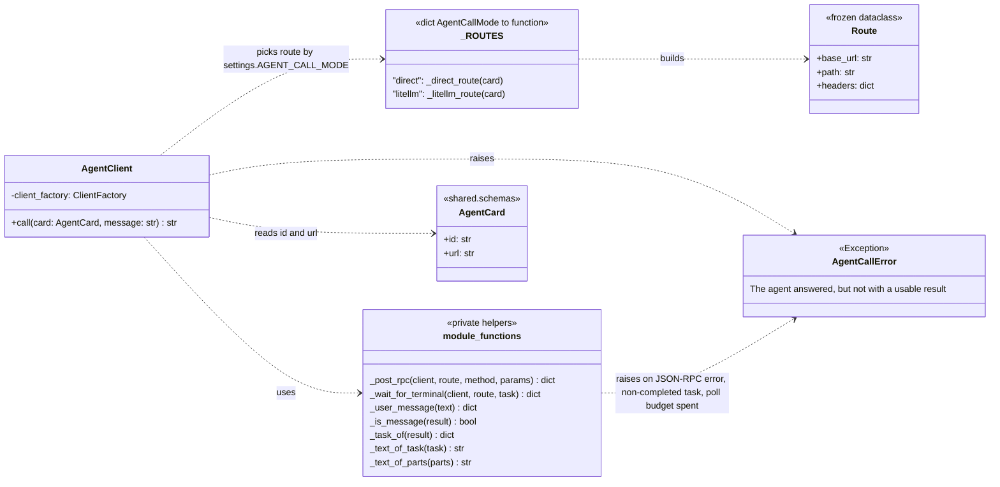
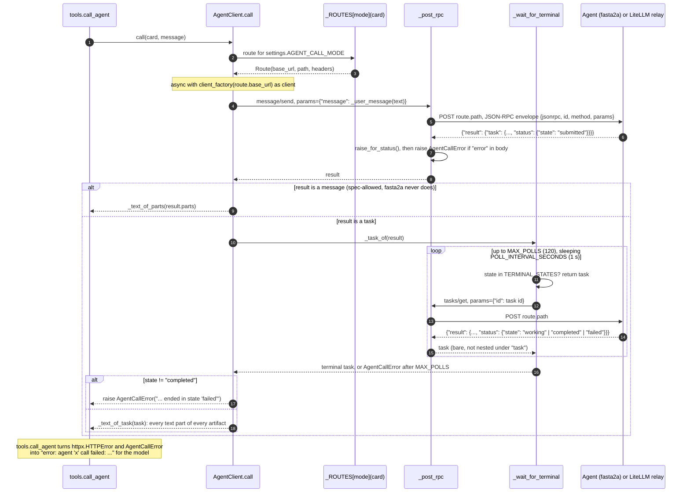

# L4: Code, `coordinator/agent_client.py`

**Question:** how does one `call_agent` tool call actually reach a
sub-agent and come back with text?
**Audience:** the developer editing `agent_client.py` or debugging an A2A
call. Legend in [README.md](README.md).

C4 has no way to show *order*, and order is the whole point of this
module (two round trips, polling until terminal). So this level pairs a
class diagram (the shape) with a UML sequence diagram (the mechanism).

## Shape

`ClientFactory` is `Callable[[str], httpx.AsyncClient]`: production passes
`default_client` (one `AsyncClient` per call, 60 s per request); tests pass
a factory returning a client with `httpx.MockTransport`, so no agent process
is needed.

## Mechanism: one `AgentClient.call(card, message)`

## Things the diagram makes visible that the code only implies

- **Two response shapes.** `message/send` nests the task under
  `result.task`; `tasks/get` returns it bare under `result`. `_task_of` is
  the one line that hides that difference (verified live against fasta2a
  2.x; the module docstring has both JSON shapes side by side).
- **Two failure families.** Transport failures (agent down, 404 relay path,
  401 bad proxy key) are `httpx.HTTPError` from `raise_for_status`;
  protocol failures (JSON-RPC `error` member, task `failed`, poll budget
  spent) are `AgentCallError`. They are kept distinct so the coordinator can
  report "unreachable" and "answered badly" differently, even though
  `tools.py` turns both into a string.
- **The route is the only mode-dependent thing.** Envelope, polling and
  text extraction are identical for `direct` and `litellm`; LiteLLM's relay
  forwards the JSON-RPC body unchanged and dispatches on `method`.

| Element | Line |
|---|---|
| `AgentCallError` | `agent_client.py:92` |
| `Route` | `:103` |
| `default_client` | `:115` |
| `AgentClient.call` | `:120` |
| `_direct_route`, `_litellm_route`, `_ROUTES` | `:151`, `:156`, `:172` |
| `_post_rpc` | `:178` |
| `_wait_for_terminal` | `:196` |
| `_user_message`, `_is_message`, `_task_of`, `_text_of_task`, `_text_of_parts` | `:212` to `:233` |
| Constants `TERMINAL_STATES`, `POLL_INTERVAL_SECONDS`, `MAX_POLLS`, `CALL_TIMEOUT_SECONDS` | `:77` to `:85` |
